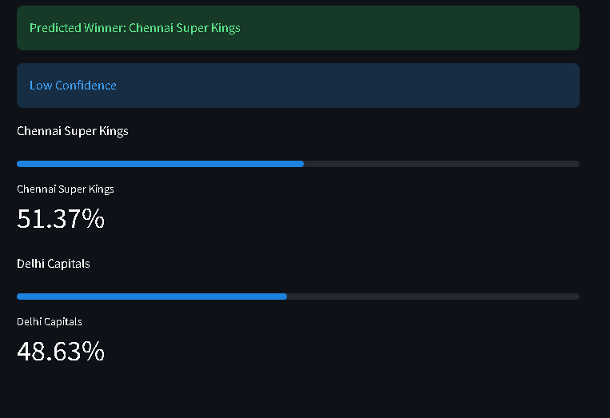
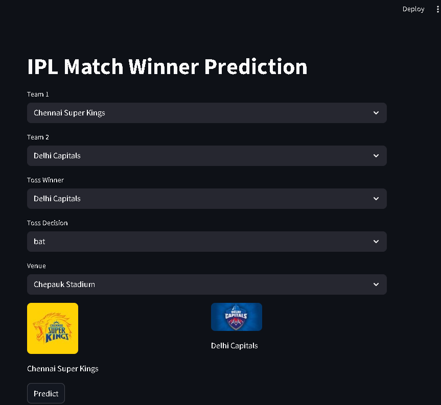

# 🏏 IPL Match Winner Prediction

A simple Machine Learning project that predicts the probability of a team winning an IPL match based on historical data.

---

## 📌 Project Overview

This project uses historical IPL match data to estimate the probability of match outcomes using a classification model.
It includes a lightweight UI built with Streamlit for interactive predictions.

---

## 🚀 Features

* Predict match winner probability
* Interactive UI using Streamlit
* Team logos and visual probability bars
* Confidence level (High / Medium / Low)
* Clean and modular code structure

---

## 🧠 Tech Stack

* Python
* Pandas
* Scikit-learn
* Streamlit

---

## 📂 Project Structure

```
ipl-winner-prediction/
│── app.py              # Streamlit UI
│── model.py            # ML logic
│── matches.csv         # Dataset
│── requirements.txt    # Dependencies
│── assets/             # Team logos
│── screenshots/        # UI screenshots
```

---

## ⚙️ Installation & Setup

1. Clone the repository:

```
git clone https://github.com/anu-ship-it/ipl-winner-prediction.git
cd ipl-winner-prediction
```

2. Install dependencies:

```
pip install -r requirements.txt
```

3. Run the application:

```
streamlit run app.py
```

---

## 📊 Model Details

* Algorithm: Logistic Regression
* Type: Binary Classification
* Features Used:

  * Team 1
  * Team 2
  * Toss Winner
  * Toss Decision
  * Venue

---

## 📉 Limitations

* Small dataset (synthetic + limited historical data)
* Does not include player-level statistics
* Does not account for real-time factors (injuries, pitch, weather)

---

## 📸 Screenshots

### UI



### Prediction Result



---

## 🎯 Future Improvements

* Add real IPL dataset (ball-by-ball data)
* Improve feature engineering (team form, player stats)
* Use advanced models (Random Forest, XGBoost)
* Deploy on cloud

---

## 📌 Conclusion

This project demonstrates how machine learning can be applied to sports analytics in a simple and interactive way.

---

## 👤 Author

Anoop Kumar
GitHub: https://github.com/anu-ship-it
